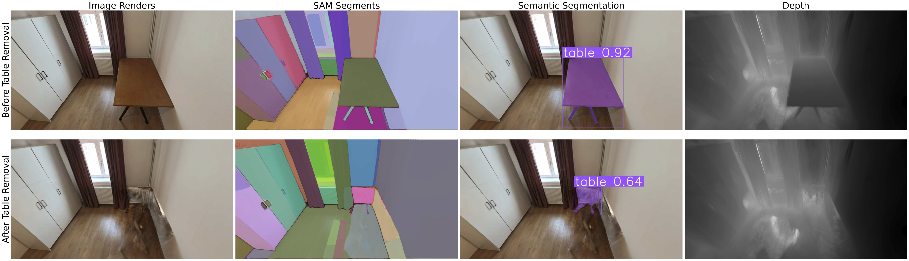

# Remove360: Benchmarking Residuals After Object Removal in 3D Gaussian Splatting

[Paper](https://arxiv.org/abs/2508.11431) · [Dataset](https://huggingface.co/datasets/simkoc/Remove360)

[Simona Kocour](https://simonakocour.github.io)<sup>1,2</sup>, [Assia Benbihi](https://abenbihi.github.io)<sup>2</sup>, [Torsten Sattler](https://tsattler.github.io)<sup>2</sup>

<sup>1</sup>Faculty of Electrical Engineering, Czech Technical University in Prague · <sup>2</sup>Czech Institute of Informatics, Robotics and Cybernetics, Czech Technical University in Prague



## Metrics

| Metric | Higher = |
|--------|----------|
| **IoU_drop** | Better removal (IoU_pre − IoU_post) |
| **acc_seg** | Better removal (frac. images with IoU_post < ξ) |
| **sim_SAM** | Better match to GT (Hungarian IoU) |
| **acc_Δdepth** | Better removal (depth change in object region) |

## Dataset

**[Remove360](https://huggingface.co/datasets/simkoc/Remove360)** — pre/post-removal RGB images and object masks for benchmarking. Use it with any removal method (GaussianCut, AuraFusion, your own, etc.).

```bash
pip install huggingface_hub
python scripts/download_dataset.py -o ./data/remove360
```

This creates an evaluation-ready layout per scene:
```
data/remove360/
  bedroom_table/
    masks/              # GT object masks (same as HF)
    images/before/      # GT before-removal images (from HF train/)
    images/after/       # GT after-removal images (from HF test/)
  living-room_sofa/
    ...
```

Add your method renders (`rgb/before/`, `rgb/after/`, `depth/`, etc.) and run evaluation.

---

## Pipeline

```
    ┌──────────────────────┐         ┌──────────────────────────────┐
    │  RGB images +        │         │    Object removal method     │
    │  object masks        │ ──────► │(GaussianCut, AuraFusion, ...)│
    └──────────────────────┘         └──────────────┬───────────────┘
                                                    │
                         ┌──────────────────────────┘
                         ▼
    ┌──────────────────────┐         ┌─────────────────────────────┐
    │  Renders: RGB +      │         │  Mask inference             │
    │  depth before/after  │ ──────► │  (GroundedSAM2, SAM)        │
    └──────────────────────┘         └──────────────┬──────────────┘
                                                    │
                                                    ▼
                                    ┌─────────────────────────────┐
                                    │  Remove360 evaluation       │
                                    │  (this repo)                │
                                    └─────────────────────────────┘
```

## Quick start

```bash
pip install -r requirements.txt
```

## Pipeline (step-by-step, skips if done)

**Option A: Run full pipeline** (input: path to scene with images/ and rgb/)

```bash
python scripts/run_pipeline.py /path/to/scene/
```

**Option B: Run steps manually**

1. **SAM** on method's after-removal renders (skips existing):
   ```bash
   python scripts/run_sam_on_rgb.py rgb/after/ -o scene/sam/after/
   ```

2. **Depth diff** (skips existing):
   ```bash
   python scripts/compute_depth_diff.py depth/before/ depth/after/ -o scene/depth_diff/
   ```

3. **GroundedSAM2** (external): Clone [Grounded-SAM-2](https://github.com/IDEA-Research/Grounded-SAM-2), run with `DUMP_JSON_RESULTS=True`, then:
   ```bash
   python scripts/convert_gsam2_to_masks.py outputs/ scene/gsam2/after/mask/ --prompt "table"
   ```

4. **Evaluation**:
   ```bash
   python scripts/evaluate_semantic.py scene/
   python scripts/evaluate_depth.py scene/
   python scripts/evaluate_sam.py scene/
   ```

Use `--no-skip` on any script to recompute all.

## Expected layout

```
scene/
├── images/before/           # GT before-removal images (from dataset)
├── images/after/            # GT after-removal images (from dataset)
├── rgb/before/              # Method renders before removal
├── rgb/after/               # Method renders after removal
├── depth/before/
├── depth/after/
├── masks/                   # GT object masks (PNG) + {image}.json (SAM on images/before)
├── gsam2/before/mask/       # GroundedSAM2 before removal
├── gsam2/after/mask/        # GroundedSAM2 after removal
├── sam/after/               # SAM on rgb/after ({image}.json per image)
└── depth_diff/              # GHT depth diff output
```

## Scripts

| Script | Purpose |
|--------|---------|
| `run_pipeline.py` | Full pipeline (SAM, depth diff, eval) with skip-if-done |
| `run_sam_on_rgb.py` | SAM on RGB → {image}.json per image |
| `compute_depth_diff.py` | GHT depth difference masks |
| `convert_gsam2_to_masks.py` | Grounded-SAM-2 JSON → PNG |
| `evaluate_semantic.py` | IoU_drop, acc_seg |
| `evaluate_depth.py` | acc_Δdepth |
| `evaluate_sam.py` | sim_SAM |
| `download_dataset.py` | Download [Remove360](https://huggingface.co/datasets/simkoc/Remove360) |

## Mask inference

**SAM** (for run_sam_on_rgb.py):
```bash
pip install git+https://github.com/facebookresearch/segment-anything.git
# Download sam_vit_h_4b8939.pth from https://dl.fbaipublicfiles.com/segment_anything/
```

**GroundedSAM2** (IoU_drop, acc_seg): External repo + `convert_gsam2_to_masks.py` (requires `pycocotools`).

## Citation

```bibtex
@article{kocour2025remove360,
  title={Remove360: Benchmarking Residuals After Object Removal in 3D Gaussian Splatting},
  author={Kocour, Simona and Benbihi, Assia and Sattler, Torsten},
  year={2025},
  eprint={2508.11431},
  archivePrefix={arXiv},
  primaryClass={cs.CV},
}
```
